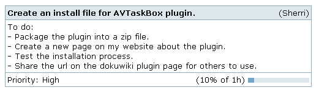

# DokuWiki Plugin: AVTaskBox



Generates nicely formatted boxes for describing project tasks or user stories.

Install and documentation:

* https://www.dokuwiki.org/plugin:avtaskbox
* Licence: GPL-2.0 (https://www.gnu.org/licenses/old-licenses/gpl-2.0.en.html)
* Author: Sherri W. (https://syntaxseed.com)

## Usage

```
<task>
TITLE: A test task
PRIORITY: High
ESTIMATE: 4h
PROGRESS: 10%
ASSIGNED: Sherri
DESCRIPTION: Some stuff for you. You can have newlines in this part. Description must be the last item.
</task>
```

## Changelog

* **2009-11-19**
  * created plugin.

* **2013-02-25**
  * Fixed image url and minor layout bugs.
  * Image fix by user monoceros84.
  * Updated this wiki page to remove comments that have been fixed.

* **2020-02-07**
  * Update for PHP v 7+
  * Add to GitHub repo.

* **2022-08-08**
  * Fix broken blank image in progress bar.